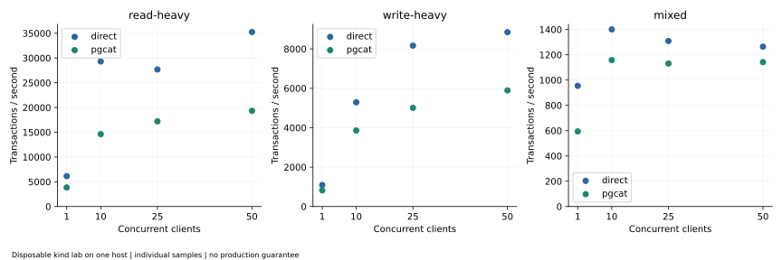

# Cloud-Native PostgreSQL Database-as-a-Service Platform

A PostgreSQL DBaaS prototype built with **FastAPI, Helm, Kubernetes, Patroni, PgCat, WAL-G and MinIO**. It provisions database stacks through an authenticated browser/API workflow and records how they behave under controlled failures. The disposable lab demonstrated isolated recovery that survives restart and three automatic node-loss recovery reruns; an earlier replica-recovery failure remains unresolved. [Evidence](docs/evidence/README.md).

## Overview

This research and platform-engineering project connects a provisioning control plane to a PostgreSQL data plane. It includes implementation, failure investigations, reproducible test tools and measured results. It is not presented as a production managed service.

## Architecture



[Mermaid source](docs/diagrams/architecture.mmd) · [Architecture guide](docs/architecture/README.md) · [Engineering report](docs/report/engineering-report.md)

## What Makes This a DBaaS

Browser/UI → FastAPI → Helm/Kubernetes → Patroni/PostgreSQL, with PgCat as the SQL connection layer and WAL-G/object storage as the recovery path. The API provisions named releases and uses existing Secret references. Durable asynchronous operations, tenant identity and continuous reconciliation remain future work.

## Core Capabilities

| Scope | Capabilities |
|---|---|
| **LIVE VALIDATED** | Authenticated provisioning; streaming replication; SQL through PgCat; backups and WAL; isolated PITR; restart durability; enforced network policies; application credential reload |
| **EXPERIMENTAL / PARTIAL** | Multi-node failure behavior, local monitoring, benchmark and recovery measurements; bounded operator scripts rather than a complete managed lifecycle |
| **NOT VALIDATED** | Independent off-site recovery, replication credential rotation, notification delivery, production failure domains and end-to-end TLS |

Validation labels apply to individual experiments. [Claims register](docs/evidence/claims-register.md) · [Project status](docs/evidence/project-status.md).

## Provisioning Flow

FastAPI authenticates the operator, checks the namespace allowlist, validates inputs, renders private values files, lints selected charts, then deploys dependencies sequentially. Failure responses identify completed releases; no automatic rollback is promised. [API flow](docs/diagrams/provisioning-flow.mmd) · [Application guide](application/README.md).

## High Availability

Patroni manages PostgreSQL leadership through Kubernetes DCS and asynchronous replication. StatefulSets supply identity and storage, not database leader election. The tested resilience profile spreads members across workers, but those workers share one host. PDBs govern voluntary eviction; they do not protect against every abrupt failure. [HA evidence](docs/evidence/README.md).

## PgCat Connection Layer

PgCat routes connections through primary/replica Services. Independent watchers atomically generate TOML from a projected Secret. The lab tested two proxies; the chart default is one. A Service can route new connections to a survivor, but an established session can disconnect. The final benchmark uses transaction pooling; the historical default is session pooling. [Connection diagram](docs/diagrams/pgcat-routing.mmd) · [Failure report](docs/report/failure-engineering.md).

## Backup and WAL Archiving

A scoped CronJob-derived Job selects the primary, verifies its role, and executes WAL-G. WAL archival is checked against database state and object keys. MinIO is a local development target, not an independent disaster-recovery site. [Backup path](docs/diagrams/backup-wal-path.mmd).

## PITR

Recovery selects a backup completed before an explicit UTC target and replays archived WAL; the validation harness checks rows around that target. Backup success alone is not restore proof. The in-place workflow is explicitly destructive. Its guards reject invalid/future targets and ownership mismatches, but do not prove complete WAL coverage before deletion; rehearse on an isolated target first. Its measurements belong to a separate experiment. [Recovery operations](docs/operations/restore-cutover.md).

## Isolated Restore

The preferred rehearsal creates a new release and new PVCs. After promotion, automatic source archive reads and writes are disabled. Tests retained recovered A and new clone C, excluded post-target B and future source D, and proved writability after graceful and abrupt replacement. Cutover remains an operator decision. [Durability evidence](results/runtime/multinode/dbaas-phase5-bc4cacdf48/isolated-durability/attempt-1/result.json).

## Security Model

Shared Bearer authentication, namespace allowlisting, namespaced RBAC and existing Secrets form the operator boundary. Values files are private and temporary; logs and evidence are redacted. This does not provide tenant identity, comprehensive TLS or a complete credential-rotation service. [Security model](docs/security/security-model.md).

## Multi-Node Reliability

The resilience lab used one control-plane container, three workers, three database members and two proxies. Local-path volumes stay tied to their node. All task-owned labs were cleaned up after validation. [Topology](docs/images/architecture/multinode-topology.svg) · [Environment and cleanup evidence](docs/evidence/README.md).

## Network Isolation

Calico allow/deny probes exercised SQL, replication, object storage and Kubernetes API flows. Unrelated clients and cross-release source SQL access were denied in the tested profile. This is not a complete multi-tenancy proof. [Trust boundaries](docs/images/architecture/network-boundaries.svg).

## Observability

Prometheus Operator, ServiceMonitors and Grafana use actual Patroni, PgCat, MinIO and Kubernetes metrics. **Seven targets refused connections:** controller-manager, etcd, scheduler and four kube-proxy endpoints. SQL-exporter metrics, API operation metrics, backup-age instrumentation and log delivery remain incomplete. [Exact targets and observed errors](docs/report/observability-gaps.md).

## Failure Testing

**Disposable Lab Measurements — NOT SLA / NOT production guarantees.**

| Experiment | Observed result | Evidence |
|---|---|---|
| API provisioning | 171.647 s in the continuation lab | [Record](results/runtime/multinode/dbaas-phase5-bc4cacdf48/provisioning.json) |
| Primary-worker loss with four clients | Promotion 24.378 s; independent SQL probe 24.554 s; first client write after observed promotion 29.150 s | [Windows](results/runtime/multinode/dbaas-phase5-bc4cacdf48/failover-windows.json) |
| Persistent clients in that run | 20,624 acknowledged writes retained; 34 failed transactions; 19 reconnects | [Windows](results/runtime/multinode/dbaas-phase5-bc4cacdf48/failover-windows.json) |
| Graceful proxy replacement | Peer stayed ready; replacement observed at 2.349 s | [Record](results/runtime/multinode/dbaas-phase5-bc4cacdf48/proxy-shutdown/attempt-2/result.json) |
| Historical replica recovery | Initial FAILED; three clean reruns converged automatically; cause unresolved | [Failure analysis](docs/report/failure-engineering.md) |

## Benchmark Results

The final matrix contains 24 completed, ten-second pgbench samples at concurrency 1/10/25/50 across direct/PgCat routes and three profiles. At ten mixed clients: direct **1,401 TPS**, PgCat **1,158 TPS**. No failed transactions were reported in completed samples; percentiles and reconnect counts were not reported. [Full measured matrix](docs/report/performance-results.md).



## Backup Impact

The paired sample measured **1,232 TPS baseline** and **1,153 TPS during backup**, a **6.40% decrease** calculated from raw values by the reporting script. The samples are too short to establish a general backup overhead. [Calculation and evidence](docs/report/performance-results.md#backup-impact).

## Recovery Measurements

The **113.8 MiB** and **500.7 MiB** payloads restored and passed writable/data checks in **15.181 s** and **16.499 s**. Payloads are compressible; timings include scheduling and checks, not replay alone. [Measured recovery results](docs/report/performance-results.md#restore-and-pitr-measurements).

## Known Failures / Limitations

- **UNRESOLVED HISTORICAL FAILURE + NOT REPRODUCED IN SUBSEQUENT CLEAN RUNS:** one source replica required manual reinitialization. It is not classified as fixed.
- Shared host, local volumes and a single MinIO constrain failure domains; chart defaults are not the full resilience profile.
- Seven broken scrape targets and incomplete instrumentation; a scrape-fault alert attempt also failed its observation bound.
- External/off-site recovery, replication credential rotation and notification delivery remain **NOT VALIDATED**.
- No production capacity, RPO, RTO or SLA is established. [Production gap analysis](docs/report/production-gap-analysis.md).

## Quick Start

Start with local checks; these commands do not deploy a cluster. Install Python 3.11 or later, Node/npm and Helm, then run from the repository root:

```bash
python3 -m venv .venv
.venv/bin/pip install -r application/app/requirements.txt -r scripts/requirements.txt
npm ci --prefix pgcat
.venv/bin/python -m unittest discover -s tests
node tests/test_ui.js
node tests/test_pgcat_health.js
.venv/bin/python tests/validate_static.py
```

With Docker available, build the project images using `bash scripts/smoke-test/build-images.sh`. For actual provisioning, follow the [owned-lab guide](docs/testing/resilience-validation.md) or [application guide](application/README.md), including Secret contracts, explicit context selection and cleanup. Do not use `init.bash` as a harmless verification command: it recreates a named kind cluster.

## Repository Structure

| Path | Purpose |
|---|---|
| `application/` | FastAPI, browser UI and packaged chart family |
| `helmCharts/` | Root Helm charts; paths retained for compatibility |
| `patroni/`, `pgcat/`, `wal-g/`, `minio/` | Image and configuration sources |
| `scripts/` | Deployment, recovery and owned-lab validation |
| `monitoring/`, `serviceMonitor/` | Dashboards, rules and discovery |
| `docs/` | Architecture, operations, audits, reports and portfolio |
| `results/` | Preserved runtime, benchmark and validation artifacts |
| `tools/reporting/` | Reproducible measurement, chart and documentation tools |

## Documentation

[Documentation map](docs/README.md) · [Engineering report](docs/report/engineering-report.md) · [Executive summary](docs/report/executive-summary.md) · [Failure engineering](docs/report/failure-engineering.md) · [Performance](docs/report/performance-results.md).

## Evidence

The [authoritative index](docs/evidence/README.md), [claims register](docs/evidence/claims-register.md) and [final validation summary](docs/evidence/final-validation-summary.md) define what may be claimed. Historical failed attempts remain separate from successful reruns. The [independent Phase 6.5 review](docs/audit/final-independent-review.md) records additional adversarial checks and publication conditions.

## Research / Engineering Lessons

Measure client recovery separately from leader promotion. Validate restores rather than trusting successful backup commands. Keep restored clusters independent from source archives. Diagnose each container during slow shutdown. Preserve unresolved failures instead of converting successful retries into a root-cause claim.
