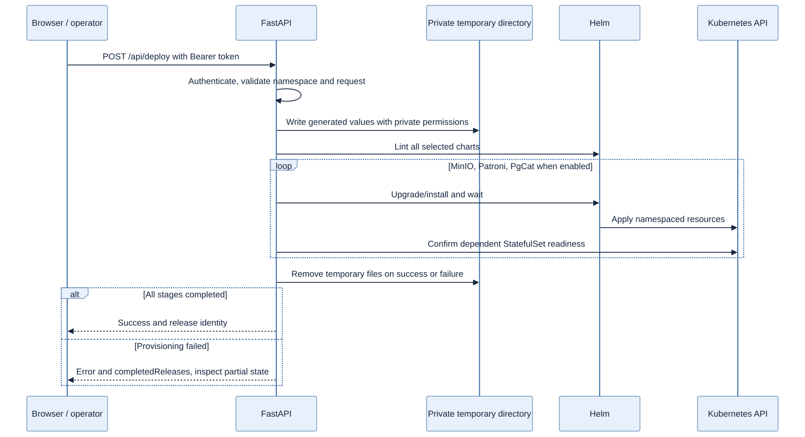

# FastAPI provisioning control plane

FastAPI serves the browser UI and executes a synchronous Helm provisioning workflow for Patroni/PostgreSQL, optional MinIO and optional PgCat. This is operator-driven provisioning; it is not a continuously reconciling database Operator.

## API flow



[Mermaid source](../docs/diagrams/provisioning-flow.mmd) · [Implementation](app/main.py).

## Browser and authentication

The UI submits a deployment request with an operator-supplied Bearer token. All `/api/` operations authenticate, apart from CORS preflight. Missing/short server tokens fail closed; incorrect credentials are rejected. The token stays out of URLs and committed values. A shared token does not identify individual tenants. [Authentication implementation](app/main.py) · [Regression tests](../tests/test_security.py).

## API lifecycle

| Route | Behavior |
|---|---|
| `GET /` | Browser form |
| `GET /healthz` | Local process liveness |
| `GET /readyz` | Local token/tool/chart prerequisites; no Kubernetes reachability guarantee |
| `POST /api/values/preview` | Authenticated, escaped and redacted values preview |
| `POST /api/deploy` | Validate, render, lint and deploy selected Helm releases |

The namespace must already exist and be allowed by the server. Deployments run in dependency order: MinIO when enabled, Patroni, then PgCat when enabled. StatefulSet readiness is checked before depending on a workload. Successful Helm orchestration is distinct from a full SQL/backup acceptance test. [Route implementation](app/main.py).

## Helm and Secrets

The backend image packages `helmCharts/`; CLI scripts use the repository's root `helmCharts/`. Both families remain maintained and tested. Existing Kubernetes Secrets are the default credential contract. Inline credentials require explicit development opt-in and are not the documented deployment path. Database/user form models do not implement SQL database creation, grants, expiry or tenant lifecycle management. [Secret contracts](../docs/security/secrets-management.md).

## Errors and temporary files

Generated values live in a per-request private temporary directory; files have private permissions and are removed on success or failure. All selected charts are linted before deployment starts. Subprocess failures propagate as sanitized API errors rather than success messages. A partial failure includes `completedReleases`; previous successful releases are retained for inspection and are not automatically rolled back. Concurrent operations have no durable per-release lock. [Implementation](app/main.py) · [Correctness regressions](../tests/test_phase1.py).

## Configuration

| Setting | Purpose |
|---|---|
| `DBAAS_API_TOKEN` | Shared operator token, minimum length enforced in code; inject through `dbaas-api-auth` |
| `DBAAS_ALLOWED_NAMESPACES` | Comma-separated allowlist; default `dbaas` |
| `DBAAS_ALLOWED_ORIGINS` | Explicit CORS origins; wildcard rejected |
| `DBAAS_ALLOW_INLINE_SECRETS` | Development opt-in; default false |

The Deployment uses a mounted ServiceAccount token/CA and namespaced RBAC. Namespace preparation belongs to the operator. Review [Deployment](k8s/deploy.yaml), [RBAC](k8s/rbac.yaml) and [API security](../docs/security/api-security.md) before using a context with real resources.

## Local checks and development

From the repository root:

```bash
python3 -m venv .venv
.venv/bin/pip install -r application/app/requirements.txt -r scripts/requirements.txt
npm ci --prefix pgcat
.venv/bin/python -m unittest discover -s tests
```

Dependencies are pinned in [app/requirements.txt](app/requirements.txt). After selecting an intentional development kubeconfig and configuring authentication/namespace settings, start locally with `.venv/bin/uvicorn application.app.main:app --host 127.0.0.1 --port 8000`. Authenticated deployment requests can mutate that selected cluster. The [owned-lab guide](../docs/testing/resilience-validation.md) generates disposable credentials and an isolated kubeconfig instead.

## Validation and limitations

Authenticated provisioning is **LIVE VALIDATED** in the [evidence index](../docs/evidence/README.md). Authorization, input validation, redaction, temporary-file cleanup and partial-error behavior have regression coverage. Durable operation recovery, multi-replica control-plane coordination, per-tenant identity/quotas, provisioning reconciliation and API operation metrics are not implemented. End-to-end TLS and production control-plane availability are **NOT VALIDATED**.
