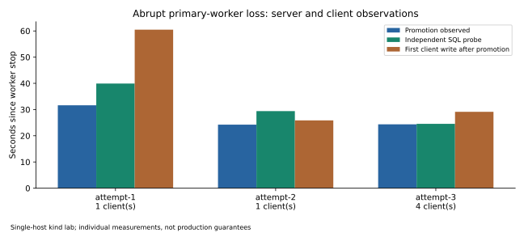
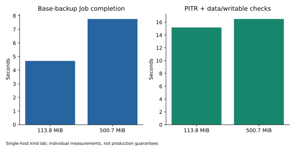

# Phase 5 continuation — 2026-10-03

This report extends the [original Phase 5 report](phase5-resilience-evidence-report.md). The original cluster's failed attempts and successful measurements remain unchanged. New experiments use `dbaas-phase5-bc4cacdf48`, a separate owned kind cluster with the same one-control-plane/three-worker layout and Calico enforcement. Both clusters share the limitations of one physical host and local storage.

## Automatic replica recovery

Initial result: **FAILED**. A surviving replica remained in archive recovery after promotion, requesting a WAL position beyond the new primary's flush position. Manual reinitialization recovered it. The exact cause remains unresolved.

The first two instrumented clean-topology reruns: **LIVE VALIDATED** for automatic convergence without reinitialization. Observed promotion/SQL-probe/stable-membership times were 31.640/39.928/68.164 seconds and 24.247/29.411/54.450 seconds. The first returned primary successfully executed `pg_rewind` with exit code zero. Checksums and `use_pg_rewind` were already enabled; no speculative rewind configuration change was made.

These successful reruns do not establish a fix for the historical failure. Before/during/after snapshots retain timelines, replication slots, WAL positions, signal files, redacted Patroni configuration, recovery settings and logs. The incompatible-timeline failure still needs a reproducible trigger before it can be closed.

[Attempt 1](../../results/runtime/multinode/dbaas-phase5-bc4cacdf48/abrupt-recovery/attempt-1/result.json) · [Attempt 2](../../results/runtime/multinode/dbaas-phase5-bc4cacdf48/abrupt-recovery/attempt-2/result.json)

## Isolated restore durability

**LIVE VALIDATED:** recovered A and new clone row C survive graceful and abrupt pod replacement; post-target B and subsequently archived source row D remain absent. The clone remains writable, `restore_command` is empty and `archive_mode` is off. Source StatefulSet identities/specifications remain unchanged. Observed replacement/check durations were 13.901 and 11.970 seconds.

The actual operator helper enforces this lifecycle: bootstrap from source backup/WAL → reach target → promote → disable automatic source archive reads and writes → operate independently. Source backup credentials remain mounted for bootstrap/manual operations; this is not credential revocation. The tested clone has one member, so replica convergence is **NOT APPLICABLE**.

[Durability evidence](../../results/runtime/multinode/dbaas-phase5-bc4cacdf48/isolated-durability/attempt-1/result.json)

## PgCat shutdown

Initial observation: the PgCat process exited promptly while the configuration watcher remained running beyond 86 seconds, until the 90-second pod grace expired. The delay belonged to the watcher.

Fix: watcher 1.1.1 handles SIGTERM/SIGINT, closes the file watcher, finishes pending atomic configuration writes, flushes the logger and exits. Shutdown has a five-second bound. PgCat's pinned image uses SIGINT and has a configured 60-second client drain budget. The pod grace remains 90 seconds to cover that budget.

Rerun: **LIVE VALIDATED**. Both containers exited code zero in approximately 0.197 seconds; a replacement with both containers ready was observed at 2.349 seconds. The other Service endpoint remained ready throughout. This idle/between-transaction result does not measure the maximum drain time of a long-running transaction.

A harness bug initially accepted an empty container-status list as ready. Its original attempt is preserved with a measurement correction; attempt 2 requires both containers ready. No earlier JSON was rewritten.

[Process diagnosis](../../results/runtime/multinode/dbaas-phase5-bc4cacdf48/proxy-graceful-process-states.json) · [Corrected timing](../../results/runtime/multinode/dbaas-phase5-bc4cacdf48/proxy-shutdown/attempt-2/result.json)

## Credential rotation

**LIVE VALIDATED:** change a disposable PostgreSQL login, update the application Secret, update the PgCat configuration Secret, and wait for projected-file/15-second-autoreload propagation. New connections succeeded with the new password and failed with the old password on the primary and each proxy. Propagation took 73.658 seconds. Existing direct/PgCat sessions completed 170/171 query samples with no failures and no reconnect loop. Proxy pod UIDs were unchanged; no PostgreSQL restart was requested.

This is a coordinated password change with an eventual propagation window, not an atomic credential transition. Existing authenticated sessions are not revoked by changing the password. Replication credential rotation is **NOT VALIDATED**.

[Rotation sequence and sessions](../../results/runtime/multinode/dbaas-phase5-bc4cacdf48/rotation-reload/attempt-1/result.json)

## Monitoring changes

The Operator runs with TLS and admission webhooks enabled, CA bundles installed, and `failurePolicy: Fail`. Certificate patch jobs use the control-plane placement/tolerations. An invalid PromQL rule was rejected by server-side dry-run validation. No insecure TLS bypass was introduced.

A separate headless Patroni metrics Service publishes port 8008 for every member, including unready pods. SQL Services retain readiness and role filtering. The ServiceMonitor selects this metrics-only Service, avoiding duplicate role-Service series and preserving visibility when PostgreSQL stops.

Upgrade both Patroni charts and the ServiceMonitor together. Old charts lack the new metrics label. SQL exporter, API operation metrics, backup-age instrumentation and notification delivery remain outside the validated scope.

[Admission evidence](../../results/runtime/multinode/dbaas-phase5-bc4cacdf48/admission-validation.json)

## Validation history

The initial continuation suite passed 72 Python tests and six Helm lints. Final validation, alert results, recovery-size measurements and cleanup are recorded below. No commit or push is authorized.

## Alert corrections and outcomes

The original leader expression counted `patroni_primary` alone. A paused clone kept that metric at 1 after PostgreSQL stopped, so the first paired database/leader rehearsal **FAILED**. The corrected rule sums `patroni_primary * patroni_postgres_running` by scope. A real `promtool` regression covers both a stopped primary and a healthy control. A live rerun observed both PostgreSQLProcessUnavailable and PatroniNoLeader pending → firing → inactive after database recovery. Completely absent metric families still need scrape-health coverage.

PgCatUnavailable uses Kubernetes available replica count, backed by the proxy's SQL readiness probe. Scaling the disposable proxy Deployment to zero and restoring it exercised inactive → pending → firing → inactive. This drill deliberately interrupts the lab Service; it is separate from the one-proxy HA drill.

The continuation's separate HTTPS scrape-fault attempt did not reach pending within its 90-second bound and remains **FAILED**. Its ServiceMonitor was restored. The prior cluster's successful PgCatMetricsUnavailable rehearsal remains historical evidence; it is not relabeled as a successful continuation rerun.

## Four-client failover under writes

A third abrupt-loss attempt used four persistent clients, each with a configured 0.01-second interval. **LIVE VALIDATED:** automatic convergence without reinitialize and no missing acknowledged IDs. **EXPERIMENTALLY MEASURED:** promotion at 24.378 seconds, independent SQL probe at 24.554 seconds, first client acknowledgement after observed promotion at 29.150 seconds, full membership convergence at 57.178 seconds. The longest per-client success gap was 32.131 seconds.

The clients acknowledged 4,768 transactions before injection and 20,624 overall; 34 transactions failed, with 19 reconnects and zero transaction replay retries. Injection-aligned throughput was 291.766 TPS before failure, 0.489 TPS during the interval ending at the SQL probe, and 315.971 TPS afterward. The afterward window still contains six failed client operations: a successful independent probe does not establish simultaneous recovery of every client. The baseline includes sequential client startup.

[Attempt 3](../../results/runtime/multinode/dbaas-phase5-bc4cacdf48/abrupt-recovery/attempt-3/result.json) · [Derived windows and raw-source boundaries](../../results/runtime/multinode/dbaas-phase5-bc4cacdf48/failover-windows.json)

The historical automatic-recovery failure remains **FAILED** with an unresolved trigger. Three clean successes establish these rerun outcomes, not a root-cause fix for that failure.

## Backup alert

BackupJobFailed completed inactive → pending → firing → inactive using the repository's actual CronJob command with a deliberately nonexistent primary selector. Logs report zero matching primaries. This proves the Job-failure signal, not backup-age or restore correctness. An earlier attempt reached firing but lost its OnFailure pod before logs were collected; the backup-only rerun uses Never/backoffLimit 0 to retain the failed pod. No metric value was injected.

[Backup alert attempt 3](../../results/runtime/multinode/dbaas-phase5-bc4cacdf48/alert-rehearsal/attempt-3/result.json)

## Evidence sanitization

The scanner initially flagged PostgreSQL startup authentication nonces and two integrity hashes keyed by secret-scan filenames. The evidence writer now redacts nonce values while retaining the log context. New continuation logs were sanitized accordingly; historical cluster artifacts were not modified. The checksum manifest uses explicit path/sha256 records. The subsequent redacted working-tree scan found no leaks. This is a scanner result, not proof that no secret could exist anywhere in the project's history.

## Benchmark and backup-impact rerun

**EXPERIMENTALLY MEASURED:** all 24 ten-second scale-1 pgbench samples completed with zero reported failed transactions, across direct/PgCat routes, concurrency 1/10/25/50 and three profiles. The prior matrix is preserved separately. Database `max_connections=200` matches the prior experiment's documented connection budget: two 60-connection proxy pools, direct clients and operational headroom. Replica-first restarts activated this setting before the rerun; no performance-maximizing tuning sweep was performed.

At ten mixed clients: direct PostgreSQL 1,401.014 TPS / 7.138 ms mean; PgCat 1,158.075 TPS / 8.635 ms. Paired 15-second mixed/10-client samples measured 1,231.640 TPS / 8.119 ms without backup and 1,152.865 TPS / 8.674 ms with backup. The backup Job completed in 5.763 seconds. Actual retained container CPU and filesystem read/write counters are included for those windows; short scrape windows do not isolate backup overhead or establish PVC durability. No percentiles or unreported reconnect counts are invented.

[Matrix](../../results/benchmarks/dbaas-phase5-bc4cacdf48/matrix/attempt-1/pgbench.json) · [Backup impact](../../results/benchmarks/dbaas-phase5-bc4cacdf48/matrix/attempt-1/backup-impact.json) · [CPU/I/O counters](../../results/benchmarks/dbaas-phase5-bc4cacdf48/matrix/attempt-1/backup-resource-metrics.json)

## Recovery-size measurements

**EXPERIMENTALLY MEASURED:** separate source payloads, base backups and new isolated targets. Both restored every deterministic pre-target row, excluded the later row, and accepted a new write. Payloads repeat md5 strings and are compressible. Catalog sizes below describe whole-cluster backups. WAL bytes cover the interval beginning before backup, including forced switches; payload-generation WAL is outside that interval. Restore time includes scheduling, bootstrap, PITR and writable/data checks; replay alone was not timed.

| Relation bytes | MiB | Backup Job seconds | Restore/check seconds | WAL interval bytes | Whole backup uncompressed / compressed bytes |
|---|---:|---:|---:|---:|---:|
| 119,349,248 | 113.8 | 4.681 | 15.181 | 38,726,304 | 247,235,322 / 13,176,134 |
| 524,992,512 | 500.7 | 7.757 | 16.499 | 44,403,544 | 652,829,434 / 22,352,638 |

The host had roughly 69 GiB free before the series; the harness requires 15 GiB minimum headroom. No 1 GiB sample was needed. Two short observations do not establish a capacity model or a production recovery objective.

[Size attempt 1](../../results/runtime/multinode/dbaas-phase5-bc4cacdf48/restore-size/attempt-1/result.json) · [Size attempt 2](../../results/runtime/multinode/dbaas-phase5-bc4cacdf48/restore-size/attempt-2/result.json)

## Changed files and design decisions

- `pgcat/pgcat-config-watcher.js`, `pgcat/logger.js`, chart/image references: explicit bounded watcher shutdown, version 1.1.1; retain PgCat's drain budget.
- Both `helmCharts/patroni/templates/metrics-service.yaml` families and `serviceMonitor/patroni-service.yaml`: keep monitoring discovery available when SQL readiness fails without changing SQL Service routing.
- `monitoring/prometheus/rules.yaml`: add proxy availability; count running primaries instead of role alone.
- `scripts/resilience/`: append-only fault, credential, alert, inventory and restore-size experiments; comparable benchmark capacity and preserved sample matrices.
- `scripts/smoke-test/evidence.py`, `tests/`: nonce redaction, shutdown/readiness/restore/metrics regressions and an executable Prometheus rule test.
- `tools/reporting/`, `docs/diagrams/`, `docs/images/`: measured chart generation, integrity-checked indexes, Mermaid sources and SVG exports.
- README, audit/operations/engineering/executive/portfolio documents: current outcomes and historical failure boundaries synchronized.

## Final validation and cleanup

**STATICALLY VALIDATED:** 74 Python tests; seven Node tests plus four SQL-readiness cases; one Prometheus rule-regression scenario covering stopped and healthy scopes; six Helm lints; YAML/JSON/Python/shell/JavaScript/TOML parsers and `git diff --check`. **BUILD VALIDATED:** seven image builds, including watcher 1.1.1; the built backend's packaged metrics template was compared with source. All 15 Mermaid sources have SVG exports; new scientific charts use measured JSON inputs only.

The owned cluster `dbaas-phase5-bc4cacdf48` was deleted, private state files removed, and the temporary inotify setting restored to 128. Only the user's unrelated `kind` cluster remains. No commit or push was performed. The original 80 runtime artifacts remain byte-for-byte unchanged; [final validation evidence](../../results/runtime/multinode/dbaas-phase5-bc4cacdf48/validation/summary.json) and the [continuation index](../evidence/phase5-continuation.md) provide the checks.

## Remaining issues

- Historical stuck-replica automatic recovery: **FAILED**, exact trigger unresolved despite three clean successful reruns. Original WAL bytes and complete pre-failure control/slot state are no longer available from the deleted cluster; current configuration/rewind successes do not reconstruct them.
- Continuation scrape-fault alert attempt: **FAILED** to reach pending within its 90-second bound; the four workload/backup alerts have independent successful evidence.
- Seven kind control-plane scrape targets remain **BROKEN** in the metric inventory; SQL/API operation metrics, backup-age instrumentation and log delivery remain **NOT IMPLEMENTED**.
- Off-site backup, off-site restore, replication credential rotation, alert notification delivery, independent storage/failure domains, production fencing/TLS/tenant isolation and sustained capacity: **NOT VALIDATED**.
- Single-host, asynchronous replication and short/compressible samples prevent any production availability, RPO, RTO or capacity claim.
