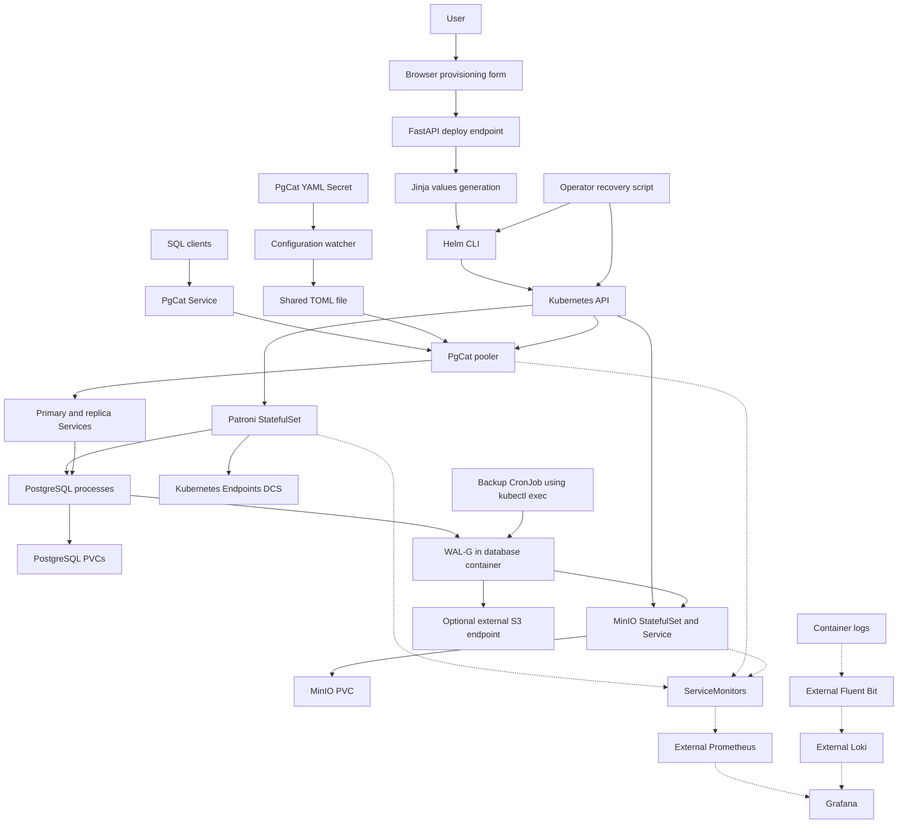

# Cloud-native PostgreSQL platform: technical audit

> Phase 3 update (2026-10-03): [reliability report](phase3-reliability-report.md) supersedes baseline findings about resource requests, probes, scheduling/PDBs, shutdown, backup deadlines and build validation. Both chart families now implement those controls; live provisioning remains blocked by the recorded in-cluster API connection failure. Earlier sections retain their dated audit evidence.

> Phase 2 update (2026-10-03): the [security and reproducibility report](phase2-security-reproducibility-report.md) supersedes earlier authentication, credential-default, preview/logging and dependency findings. Default chart/API input now uses external Secrets; inline values require development opt-in. Phase 1 behavior remains covered by regression tests. Earlier sections preserve their dated evidence.

Audit date: **2026-10-01**. Audited source: **`c275fc2dd3c4e8e9db1e28eadf50100e3cfcbbc1`**, branch `feat/dbaas-application`.

## Phase 1 amendment — current working tree

[Phase 1 correctness report](phase1-correctness-report.md) records the implementation and validation. The original audit below remains a historical assessment of the cited revision; its defect reproductions and line references do not describe the corrected working tree. The updated [risk register](runtime-risk-register.md#phase-1-status--2026-10-01) maps every affected risk ID to current status.

- Provisioning now uses one validated context, explicit Patroni release names, private temporary files, ordered Helm waits and failure reporting. Namespace/bootstrap permissions are operator prerequisites; default Patroni charts no longer require API-bypass cluster privileges.
- Both active chart families scope PgCat, pgAdmin and MinIO selectors/resources by release. PgCat default rendering, primary/replica naming, governing Services and exporter-port wiring are corrected. Existing immutable resources need controlled migration.
- Backup Jobs now require exactly one primary, forward the script over stdin and propagate discovery, role-check and WAL-G failures. Recovery defaults to inspection, checks resource/backup ownership and explicitly selected PVC identities, and requires `--execute` before deletion. Restore honors the selected base backup.
- One browser handler sends optional administrator/replication credentials and waits for a confirmed API success. Correction to the baseline: those credential inputs/mappings were absent, rather than collected and dropped. Unsupported grants/monitoring are marked Planned; PITR is an Experimental operator workflow, rejected by provisioning.
- Local regression tests and lint/render/parser checks support these changes. No live provisioning, scrape, routing, backup, failover or PITR success is claimed. Authentication, secret redesign, HA tuning, SQL object provisioning and reconciliation remain outside this phase.

The watcher and Patroni image changes require rebuilding images; checked-in image references do not prove published images contain this source. The original Mermaid diagram remains a high-level architecture source; the architecture has not been replaced.

## Baseline audit (historical)

## Executive assessment

This repository is a **PostgreSQL Database-as-a-Service prototype with an existing FastAPI provisioning control plane and browser UI**. It is more than a collection of database manifests. The backend accepts a service specification, generates Helm values, and sequences MinIO, Patroni/PostgreSQL, and optional PgCat releases. The database side includes Kubernetes-based Patroni coordination, role-selected Services, a PgCat configuration sidecar, and WAL-G archive/restore integration.

It is not yet a production-grade managed database service. Provisioning has confirmed integration defects; backups can report success without doing work; recovery can delete data before validating prerequisites; and the application has neither authentication nor lifecycle state management. A clean install using only the supplied backend RBAC cannot create all chart resources. No end-to-end availability, durability, recovery, or performance result was established by this audit.

The strongest next step is to make the existing architecture correct, secure, and testable. Replacing it with a new operator or building a new control plane before fixing these paths is not necessary.

### Companion documents

- [Repository map](repository-map.md): paths, chart comparison, entry points, namespaces.
- [DBaaS capability matrix](dbaas-capability-matrix.md): implementation status of each product operation.
- [Runtime risk register](runtime-risk-register.md): severity, confidence, evidence, and proposed fixes.

### Scope and evidence rules

All tracked application/configuration surfaces were inspected, including raw manifests, both chart trees, scripts, Dockerfiles, UI, observability values, and storage examples. The Rook gitlink is unavailable as a reproducible checkout because its `.gitmodules` mapping is missing. The research PDF's extracted text has damaged glyphs and was not treated as proof of runtime behavior.

Source inspection, Helm rendering, parser checks, synthetic Jinja inputs, mocked backend execution, and a stub-DOM JavaScript execution support the findings. No deployment, real backup/restore, image build/pull, Kubernetes authorization probe, or browser integration test was performed. Published custom image contents and the live cluster are unknown. External upstream sources clarify controller/tool behavior; they do not establish the version actually deployed.

Only the four requested Markdown audit files were created. Architecture source is embedded below as Mermaid. SVG/PNG export was not performed because the task restricts output to these four files. No credentials, screenshots, invented dashboards, or fabricated operational measurements are included.

## 1. System architecture

| Layer / component | Supported role in this repository | Relationships and limits |
|---|---|---|
| Browser UI | User-facing provisioning interface | Collects service settings and posts to FastAPI; no cluster inventory/status screen |
| FastAPI | Imperative DBaaS provisioning control plane | Chooses charts, renders values, runs Helm; no background reconciliation or durable operation store |
| Helm and Jinja | Provisioning layer | Jinja translates request models to values; Helm creates/upgrades three independent releases |
| Kubernetes API/controllers | Resource control and Patroni coordination substrate | Helm submits resources; StatefulSet/Deployment/Job controllers operate them; Patroni uses Endpoints DCS |
| Patroni | PostgreSQL HA control component | Bootstraps PostgreSQL, participates in leader coordination, manages role labels and replication via upstream behavior |
| PostgreSQL | Database data plane | Stores user data on per-pod PVCs; primary and replica access through role-selected Services |
| PgCat | Optional connection/routing layer | Pooling and query parser routing configured to primary/replica Services; not the HA election authority |
| PgCat watcher | Local configuration adapter | Reads projected YAML Secret and writes TOML into shared `emptyDir`; does not discover Patroni via API |
| WAL-G | Backup/archive/restore tooling | Binary injected by init container; PostgreSQL invokes WAL archival/fetch; CronJob executes base backup in DB container |
| MinIO | Optional S3-compatible backup storage | One StatefulSet data directory/PVC per pod; initialization creates bucket and backup user; no distributed mode configured |
| PVCs / StorageClasses | Persistent storage layer | PostgreSQL and MinIO request RWO volumes; charts default to `standard`; local OpenEBS class and Rook values are separate assets |
| ServiceMonitors / metrics Services | Observability integration | Declare scrape targets for an externally installed Prometheus Operator stack |
| Prometheus / Grafana | Referenced external observability services | Release labels, datasource values, and Grafana ingress exist; installation is not in the provided provisioning flow |
| Loki / Fluent Bit | Logging integration configuration | Values intend container logs → Fluent Bit → Loki → Grafana; external charts/versions must be supplied |
| Ingress | HTTP UI/admin routing | Traefik routes for pgAdmin, MinIO console, Grafana; standard Ingress for API/UI. No external PostgreSQL TCP ingress is defined |
| Recovery script | Operator recovery orchestration | Uninstalls releases, attempts PVC deletion, reinstalls restore-mode Patroni, reinstalls PgCat; not a safe product restore service |

### Architecture source

Solid connections below represent explicit wiring in source, not verified runtime success. Dotted connections are externally supplied observability integrations. Confirmed defects are described in later sections.

The diagram does not imply both MinIO and external S3 are used simultaneously. The selected WAL-G endpoint determines the destination. The architecture currently relies on Kubernetes/Patroni to reconcile resource and database state, while the FastAPI layer only issues deployment commands.

## 2. Existing DBaaS capability

The [capability matrix](dbaas-capability-matrix.md) is the authoritative per-operation classification. Narrowly implemented primitives include HTTP submission, values generation, initial replica/storage configuration, and serving the UI. Complete cluster creation is **PARTIALLY IMPLEMENTED** because of backend permissions and integration defects. Existing-release resubmission offers partial scaling/update behavior.

There are no product operations to list/delete clusters, retrieve ongoing cluster status or connection information, trigger/list backups, select PostgreSQL version, configure compute resources, or rotate credentials. Operator scripts and upstream CLIs must not be counted as corresponding UI/API operations. Restore/PITR plumbing exists but is **Experimental** and incomplete as a safe lifecycle operation.

Database/user/access controls deserve particular care: the application collects them but does not execute SQL to create databases, roles, grants, or expiry. PgCat pool/user entries are not PostgreSQL object provisioning. The first database name also becomes WAL-G's `PGDATABASE`; choosing an uncreated database can affect backup connectivity.

## 3. Provisioning flow

### HTTP surface

Source: [`application/app/main.py`](../../application/app/main.py), route definitions at lines 242–389.

| Endpoint | Actual behavior |
|---|---|
| `GET /` | Reads `static/index.html` relative to process working directory |
| `/static/*` | StaticFiles mount |
| `GET /healthz` | Returns constant `{"ok": true}`; does not inspect Helm, Kubernetes, or databases |
| `POST /api/values/preview` | Validates `DeploySpec`, renders values, returns HTML containing them |
| `POST /api/deploy` | Validates `DeploySpec`, then sequentially installs/upgrades component releases |
| `/docs`, `/redoc`, `/openapi.json`, `/docs/oauth2-redirect` | Framework-generated documentation routes observed on the application object |

There are no other application lifecycle endpoints.

### Request models and validation

`DeploySpec` contains namespace, project, PostgreSQL settings, database/user/access lists, and optional WAL-G/MinIO/monitoring objects. Supporting models are `Project`, `PostgresCreds`, `Postgres`, `DB`, `User`, `AccessRule`, `WalGS3`, `WalGBackup`, `WalG`, `Monitoring`, and `MinioSpec`.

Pydantic supplies type validation. MinIO passwords have minimum lengths, MinIO storage has a positive bound, and its backup user must differ from its root user. In contrast, PostgreSQL replica/storage values have no positive bounds, pool/access modes are arbitrary strings, and release/namespace identifiers are not validated against Kubernetes/Helm naming constraints. `assert_dns_label()` is defined but never called. Most models ignore extra fields. Synthetic tests confirmed acceptance of a negative replica count and a traversal-like release name. Those tests did not write files or execute Helm.

### Browser behavior

`buildNestedConfig()` collects form fields; `validateForm()` checks required/visible inputs, selected numeric bounds, URLs, and a restrictive cron expression. The first script contains a top-level reference to undefined `cfg` (line 685), which stops execution before its submit listener and `init()` call. A stub-DOM test reproduced this exception. Functions declared earlier remain available; a second script registers `handleSubmit()` on `DOMContentLoaded`, so it is inaccurate to call the entire UI dead.

Both submit payload variants reconstruct `postgresql` with only replica count/storage size, dropping collected superuser/replication credentials. The active second handler includes MinIO settings but omits collected monitoring settings. It logs the full payload in the browser console. Fixing only the `cfg` exception would enable two submit handlers and risk duplicate deployment requests. UI integration testing is needed after consolidating them.

### Actual sequence

1. The browser posts JSON to `/api/deploy`; direct API callers can submit additional supported model fields.
2. FastAPI/Pydantic parses `DeploySpec`. `deploy()` rejects enabled MinIO without its specification but performs no user authorization or Kubernetes preflight.
3. `find_chart()` has already resolved all three chart paths at module import. The container's bundled charts live under `/app/helmCharts`; environment overrides/current directory can change selection.
4. `deploy()` builds a Jinja context with `release`, `namespace`, `project`, `postgresql`, `databases`, `users`, `minio`, `walg`, `monitoring`, and `access`. It does **not** include `_patroniRelease`.
5. If MinIO is enabled, it renders `minio-values.yaml.j2`, writes `/tmp/<release>-minio-values-<UTC-second>.yaml`, and runs Helm for `<release>-minio` with `--wait --timeout 5m0s`. After success it sleeps 60 seconds.
6. It renders Patroni values into a similarly named file and runs Helm for `<release>-patroni` with `--wait --timeout 10m0s`, then sleeps 10 seconds.
7. If PgCat is enabled, it renders PgCat values and runs Helm for `<release>-pgcat` with `--wait --timeout 5m0s`.
8. Every command uses `helm upgrade --install`, `--namespace <requested namespace>`, `--create-namespace`, and `-f <file>`. Helm contacts Kubernetes using the process's available kubeconfig/in-cluster identity. The backend does not instantiate a Kubernetes SDK client. Its only explicit `kubectl` call is commented out.
9. Kubernetes resources include data PVCs, StatefulSets, role Services, Secrets, RBAC, backup CronJob, optional MinIO init hook, optional PgCat/pgAdmin resources and pgAdmin IngressRoute.
10. The response contains `ok`, original project `release`, `namespace`, and concatenated Helm `output`. It contains **no structured connection details**.

The values files persist in `/tmp`; there is no cleanup. `run()` uses a subprocess argument list, merges stderr into stdout, and has no Python-level timeout. Helm's own wait timeouts do not form an overall HTTP operation deadline. The endpoint is synchronous; an `async` logging middleware does not make deployment a background operation.

### Failures, status, and rollback

Nonzero subprocess exits become HTTP 400 with command/output text. Request model errors normally use FastAPI's validation handling. The generic exception handler returns HTTP 500 with `str(exc)`; framework HTTPException handling is separate, so the handler's special case does not standardize all errors into one envelope. Raw subprocess output may reveal configuration/infrastructure details. The UI prints response text but cannot poll an operation.

`--wait` supplies some resource readiness detection, and MinIO's application chart uses an install/upgrade hook. These do not verify SQL access through PgCat, successful backups, or restored data. There is no `--atomic`, application rollback, compensation across releases, durable failure record, retry state, cancellation, or cleanup. A later failure leaves earlier releases running. Disabling a previously enabled component simply skips its Helm call; it does not remove the existing release.

## 4. Control plane assessment

| Dimension | Present behavior | Production limitation |
|---|---|---|
| Lifecycle management | Create/update orchestration through Helm | No inventory/delete/status/backup lifecycle API |
| Idempotency | Stable release suffixes and `upgrade --install` | No request idempotency key; immutable Jobs/resources, partial steps, and credential changes can break repeats |
| Reconciliation | Kubernetes controllers and Patroni handle their own state | FastAPI never compares desired vs actual whole-service state after request completion |
| Source of truth | Request data, chart defaults, generated files, Helm releases, Kubernetes objects, Patroni DCS | No persisted service spec with tenant ownership and desired state; request files are not an adequate record |
| Asynchronous work | Synchronous subprocess and sleeps in request handler | No queue, durable operation ID, progress API, retry/cancellation |
| Failure handling | Nonzero exit aborts remaining Python flow | No recovery of partially provisioned services or reliable resumption after process loss |
| Rollback | None at application level | Database state cannot safely be rolled back merely by Helm revision rollback |
| State tracking | Helm records/Kubernetes state exist externally | App does not list/query them; health endpoint only checks handler execution |
| Concurrency | Multiple requests can enter deployment code | Same release/component/second filename collision, including across namespaces; no lock. Helm's release lock does not protect all three releases or pre-Helm files |
| Authentication / authorization | None | All reachable callers use backend identity; namespace is caller supplied |
| Multi-user safety | No ownership model | Shared names/selectors, privileges, and temporary files permit interference |
| Tenant isolation | Namespace field only | No policy enforcement, quotas, network isolation, or release ownership |
| Credentials | Models, some Secrets, redacted Python context logs | Committed defaults, plaintext temps, raw preview, browser logging, no coordinated rotation |
| API semantics | Basic validation and command-error response | No stable domain error contract, conflict semantics, service status, or readiness contract |

**Why it is a control plane today:** it accepts user intent and changes Kubernetes-managed database infrastructure through a concrete provisioning pipeline. It is an imperative provisioning control plane, not a database operator/reconciliation controller.

**Why it is not production-grade:** correctness, privilege, isolation, recovery, state, and concurrency gaps prevent a dependable multi-user service. This conclusion does not erase the existing architecture or require starting over.

**Honest description:** “A Kubernetes PostgreSQL DBaaS prototype with a FastAPI and browser provisioning control plane, Helm-based deployment, Patroni coordination, PgCat configuration, and WAL-G/MinIO backup and recovery integration. Production hardening and end-to-end validation are ongoing.”

## 5. PostgreSQL high availability

Sources: [`patroni/entrypoint.sh`](../../patroni/entrypoint.sh), both `patroni/templates/patroni_k8s.yaml` and `db_services_k8s.yaml`, and chart values.

### Bootstrap and coordination

The Dockerfile starts from `postgres:16` and installs Patroni from unpinned Git. The entrypoint generates `/home/postgres/patroni.yml`. If `BACKUP_ENABLE` is exactly `true`, it selects custom WAL-G bootstrap; otherwise it selects `initdb`. Initial database options enable data checksums, UTF-8, `en_US.UTF-8`, host MD5 authentication, and local trust. The entrypoint unsets password environment variables after writing configuration, but the file still contains the passwords.

Pod name/IP/namespace are supplied via the downward API. Chart scope is `<release>-patronimvp`; labels contain application, cluster name, and release name. `PATRONI_KUBERNETES_USE_ENDPOINTS=true` selects Endpoints coordination and `PATRONI_KUBERNETES_BYPASS_API_SERVICE=true` requests direct API endpoint access. RBAC grants namespaced endpoint/configmap/pod operations and separate access to the Kubernetes API Endpoints object. No standalone etcd deployment exists here; Kubernetes' own backing store is outside repository scope.

Leader election and promotion are delegated to Patroni's upstream implementation, not custom code. Local source does not set election TTL/loop/retry policy or synchronous replication. The root binding is wrong outside `default`; the application copy fixes this subject namespace. Current upstream explains Endpoints coordination and role labels, but the version in the published custom image is not established. [Patroni Kubernetes/configuration reference](https://patroni.readthedocs.io/en/latest/yaml_configuration.html).

### Replication and failover

Replication credentials are supplied separately from superuser credentials. HBA permits the replication user from pod-IP-derived `/16` and loopback, and permits password-authenticated client connections from all IPv4 addresses. This does not require TLS and assumes the CNI subnet matches the rule. `wal_level=replica` is supplied in PostgreSQL parameters. Replica initialization/streaming is delegated to Patroni's defaults; no custom `create_replica_methods` or explicit slot inventory exists. `use_pg_rewind: true` and initdb data checksums support the intended rejoin path; actual rewind was not tested.

Replication slots are **not explicitly configured by this repository**. Current Patroni source defaults `use_slots` to true, but that is a dependency default, not a checked-in slot policy or evidence that slots are active in a deployed cluster. No WAL retention bounds, lag-aware read policy, failover loss threshold, or slot-monitoring policy is recorded here. [Patroni default configuration source](https://github.com/patroni/patroni/blob/master/patroni/config.py).

Patroni role changes are intended to redirect Service membership after promotion. No automatic-failover test, fencing test, split-brain test, switchover runbook, or measured failover time exists in the tracked implementation. Bootstrap DCS settings are initial settings; editing them in a later container configuration does not itself update established DCS state. [Patroni bootstrap configuration semantics](https://github.com/patroni/patroni/blob/master/docs/yaml_configuration.rst).

### Service discovery

| Service | Selection / purpose |
|---|---|
| `<release>-patronimvp-config` | Headless Service with no selector, intended to support Patroni configuration Endpoint lifecycle |
| `patronimvp-master-<release>` | `application=patroni`, cluster/release labels, `role=primary`; ports 5432 and 8008 |
| `patronimvp-replica-<release>` | Same scope, `role=replica`; ports 5432 and 8008 |
| StatefulSet `serviceName` | `<release>-patronimvp`, which lacks a matching explicitly defined governing Service |

The primary Service is selected by pod role; it is not itself Patroni's leader lock. PgCat reaches these Services through DNS. Raw manifests use `patronidemo` names and contain invalid Service selector structure; they are not interchangeable with the chart path.

### Availability boundaries

Root chart defaults specify two database pods; API defaults specify one. No anti-affinity/topology spread prevents colocating all replicas. No PDB protects planned disruptions. The example kind cluster has only one control-plane node. Default storage is whatever `standard` means in the target cluster. Asynchronous/default replication and a PVC do not establish zero data loss. A configured HA mechanism is defensible; a proven HA service or availability commitment is not.

## 6. PgCat routing and configuration

Both chart variants share the same proxy/pgAdmin templates. A Secret stores YAML under `pgcat.yaml`; a read-only projection mounts it at `/config/pgcat.yaml`. The watcher sidecar converts it into `/etc/pgcat/pgcat.toml` on a shared `emptyDir`; PgCat mounts that directory. There is no API watch of Patroni topology: routing relies on Kubernetes role Services.

`generatePgcatConfig()` emits admin authentication, user/password entries, pool size, statement timeout, pool mode, shards, and primary/replica backend tuples. Pool mode defaults to `session`. Query parser and read/write splitting are explicitly enabled; `default_role="any"`, primary-read policy, and backend roles are emitted. This is implemented routing configuration, not proof every SQL/transaction pattern is safely routed. No routing integration tests exist, and the untagged PgCat image prevents tying behavior to a known binary.

Credentials originate from root/app chart defaults, direct API credentials/users, or Jinja fallback defaults; the UI currently drops entered PostgreSQL administrative credentials. PgCat user definitions are independent of PostgreSQL role creation, which is missing.

### Confirmed name propagation defect

The active Jinja template references `_patroniRelease` for both pool hosts and pgAdmin's Patroni reference. `deploy()` never sets it; repository search found no other producer. Running the real deployment function with its side effects mocked rendered an empty `patroniReleaseName` and `patronimvp-master-`. The actual created Service for project `audit` would be `patronimvp-master-audit-patroni`. This is a confirmed active runtime configuration defect, not merely a bare-chart default issue or dead code.

### Metrics and reload

`9930` is the intended current exporter port: watcher fallback, chart values, and application template agree. `serviceMonitor/pgcat-service.yaml` forwards to `9898`, so its target differs. Upstream's example also sets `prometheus_exporter_port=9930`; the explicit local configuration is sufficient to decide the intended value. Upstream also supports the emitted `autoreload=15000` setting. These are configured values, not measured reload latency. [PgCat upstream example](https://github.com/postgresml/pgcat/blob/main/pgcat.toml).

The watcher reads/writes once at startup, then listens only for `change`. Writes are not atomic and concurrent changes are not serialized. `applyConfig()` catches and logs errors without exiting or updating a health signal. Missing config invokes a default write into the normally read-only Secret path and can throw outside the catch. No init gate ensures TOML exists before PgCat starts. Secret volume symlink replacement behavior and malformed-config reload need actual integration tests. Debug calls include entire credential-bearing objects; Winston logger defaults to `info`, so those calls are a latent exposure path rather than proof of default debug disclosure.

The generated shutdown timeout is 60 seconds while the pod has no explicit grace period override. Kubernetes' usual 30-second default may truncate the intended drain; align the actual image shutdown behavior and pod grace after testing rather than assuming connection preservation.

## 7. Backup architecture

WAL-G v3.0.7 is downloaded by the local Dockerfile as a Linux amd64 binary. A Patroni init container copies it into an `emptyDir` mounted at `/wal-g` by the database container. Archive, fetch, and base-backup commands run in the PostgreSQL container, not as a long-lived WAL-G sidecar. The init container also constructs `restore_backup.sh` for the chart path.

The `.walg.env` Kubernetes Secret supplies local database connection settings, S3 credentials, endpoint, bucket prefix, region, path-style option, and Brotli compression. The format is supported by WAL-G's documented envfile configuration; its `.env` extension alone is not a defect. [WAL-G v3.0.7 configuration](https://github.com/wal-g/wal-g/tree/v3.0.7).

| Mechanism | Actual configuration |
|---|---|
| WAL archival | `archive_mode: on`, `archive_timeout: 60`, and `archive_command` calling `/wal-g/wal-g wal-push --config /wal-g-credentials/.walg.env %p` |
| WAL recovery | `restore_command` calls `/wal-g/wal-g wal-fetch --config /wal-g-credentials/.walg.env %f %p` |
| Base backup | CronJob executes ConfigMap script with `wal-g backup-push <PG_DATA_DIR> --config ...` inside selected Patroni container |
| Schedule | Root/app chart defaults `0 0 * * *`; application generation defaults `0 2 * * *`; no explicit CronJob time zone |
| Job retry | `backoffLimit: 1`, restart policy `OnFailure`; no concurrency policy/deadline/backup verification |
| Default chart destination | `s3://backup` at `http://minio-mvp-minio:9000` |
| Application MinIO destination | User-selected bucket at `http://<project>-minio-minio:9000` |
| External destination | Optional S3 settings from API; omitted settings may leave chart defaults |
| Retention / independent copy | No WAL-G retention/deletion job, bucket lifecycle, object lock, independent failure-domain copy, or verification policy found |

MinIO startup creates a local data server, an S3/console Service, and an initialization Job for a backup user and bucket. Application chart credentials use Secrets; the root chart embeds them in script ConfigMaps. The backup user receives broad `readwrite`, not a bucket-specific least-privilege policy. The app hook runs after install/upgrade and quotes shell variables but skips password changes for existing users. S3 connections in supplied defaults are HTTP.

### CronJob correctness

Both Patroni chart copies build `LABEL_SELECTOR` from `backup.RESTART_POLICY` instead of `backup.LABEL_SELECTOR`. The rendered result is `OnFailure,release-name=<release>`. Kubernetes interprets the bare token as existence of label `OnFailure`; source pods do not have it. This normally yields zero candidates. The shell has no `set -e`, and an empty loop exits zero. A mocked failed `kubectl get` also ended in status zero. Thus a green Job can mean no backup. The raw CronJob uses the intended primary selector but remains a separate path and lacks this failure checking.

The intended action is to target the current primary of the selected release. Role selection alone also needs race/error handling if primary changes during backup. Schedule interpolation lacks `quote`; a leading-star cron expression fails Helm rendering. No backup-age alarm or catalog verifies that WAL/base backups form a recoverable chain. `archive_timeout=60` is a setting, not evidence of a 60-second RPO.

## 8. Point-in-time recovery

### Implemented operator path

1. `ptr_recovery.sh` accepts Patroni/PgCat release overrides and requires `--recovery-time 'YYYY-MM-DD HH:MM:SS'`.
2. It validates only textual shape, not calendar validity, timezone, backup timestamp, or WAL coverage.
3. It fixes namespace to `default`, uninstalls PgCat and Patroni, and suppresses uninstall errors.
4. It issues PVC deletion with `application=patroni,release-name=<release>` and suppresses errors.
5. It installs root Patroni with `postgres.BACKUP_ENABLE=true` and target time. It does not preserve/reapply original custom values, external credentials, topology, or storage choices.
6. New Patroni bootstrap invokes `/wal-g/commands/restore_backup.sh <data dir> true`.
7. The generated script fetches `LATEST`, ignoring `BASE_BACKUP_NAME`. It uses `exec`, so the following success echo is unreachable after successful exec.
8. Patroni recovery configuration requests `recovery_target_timeline: latest`, target timestamp, and `recovery_target_action: promote`; WAL-G supplies WAL through `wal-fetch`.
9. The operator script waits for StatefulSet rollout up to its configured timeout, reinstalls PgCat using chart defaults, and prints a success message. It performs no SQL assertion of recovery point, timeline, data, or client access.

An existing nonempty data directory can bypass fresh bootstrap semantics. A backup completed after the desired target is not a valid starting point for restoring to that earlier point. `latest` timeline selection is configured, but no timeline ancestry selection/validation is implemented. Successful intended recovery would promote the restored database and resume Patroni-managed operation; that outcome was not observed. Custom bootstrap and replica bootstrap are distinct upstream operations. [Patroni bootstrap reference](https://patroni.readthedocs.io/en/latest/replica_bootstrap.html).

### Paths, namespaces, and PVCs

`../helmCharts/patroni` is correct from `scripts/`, whereas `./helmCharts/pgcat` is correct from repository root; both do not resolve to the intended charts from one normal working directory. Fixed `default` also differs from `deploy.sh`'s `dbaas`. The script can remove resources and only then discover a bad path.

The PVC template has stale `spilo` labels. **This is not proof deletion matches nothing.** The Kubernetes StatefulSet controller merges selector labels into generated claims, overwriting duplicate keys. New claims may therefore match the deletion selector. Live/imported/raw-path claims need inspection, and the script contains no such inventory/preflight. With a deleting storage reclaim policy, deleting claims can destroy underlying data. [Kubernetes claim construction](https://github.com/kubernetes/kubernetes/blob/master/pkg/controller/statefulset/stateful_set_utils.go).

### Recovery risk classification

| Operation | Classification | Reason |
|---|---|---|
| Read templates / render Helm / inspect backups read-only | SAFE | No cluster state mutation; still protect rendered secrets |
| Restore into new, isolated namespace/release/volumes | REQUIRES CAUTION | Recommended **Planned** workflow; source does not yet implement isolation/cutover checks |
| Change bootstrap settings on an existing release | REQUIRES CAUTION | Existing data/DCS can prevent intended bootstrap; credentials and backup target must be preserved |
| Current recovery script as a whole | DESTRUCTIVE | Uninstalls active components and attempts volume deletion before validation |
| PVC deletion | DESTRUCTIVE | Can permanently remove sole local data; selector is not a safety guarantee |
| Promote restored cluster / reconnect application writes | REQUIRES CAUTION | Must verify target and fence old writers; no cutover validation implemented |
| `init.bash` lab reset | DESTRUCTIVE | Deletes named kind cluster before creation |

No claim of tested PITR, RPO, or RTO is justified. The UI `enablePITR` toggle is not a restore wizard: it changes bootstrap mode without collecting target time.

## 9. Helm architecture and 10. Namespace model

The [repository map](repository-map.md#chart-lookup-and-drift) contains the complete six-chart comparison and [namespace trace](repository-map.md#namespace-map). Root charts serve scripts/manual Helm; application charts are copied into the API image. Shared templates plus selective MinIO/RBAC fixes indicate a partial migration with duplication debt, not two clearly documented independent products.

The root Patroni binding points to the wrong ServiceAccount identity when deployed in `dbaas`. Namespaced RBAC remains separately available, so this does not mean all Patroni API permissions disappear: the missing intended privilege is the cluster-bound read of Kubernetes API Endpoints used for bypass. Exact failure/fallback depends on Patroni runtime. The application chart fixes that binding, but backend installation RBAC still cannot create the required RBAC/ServiceAccounts. RBAC permission to create a Role/Binding alone also does not permit privilege escalation beyond the caller's authority. [Kubernetes RBAC constraints](https://kubernetes.io/docs/reference/access-authn-authz/rbac/).

PgCat pools and MinIO endpoints use short DNS names within the release namespace. Observability remains fixed to `dbaas`/`monitoring`/`logging`. Custom namespace deployment therefore does not automatically gain scrapes, ingress, or logging setup. Reusing release names across namespaces also interacts with root chart cluster-scoped RBAC names and application temp-file collisions.

## 11. Secrets and security

### Classification

Categories are not mutually exclusive: a sample-looking password becomes a runtime credential when deployed unchanged. “Definitely unsafe” describes the handling/default, not proof that a particular credential is a real production secret. Credential validity was not tested; values are intentionally omitted.

| Tracked location | Fields / handling | Classification |
|---|---|---|
| `helmCharts/patroni/{values.yaml,values-base.yaml}` and application copies | PostgreSQL superuser/replication and S3 access/secret defaults | Test/example-looking; potentially sensitive if reused; definitely unsafe as shared live defaults |
| Root/app MinIO `values.yaml` | Root and backup-user passwords; root spelling differs | Same classification; actually consumed by templates |
| Root PgCat `values.yaml`, app `pgcat-values.yaml` | PgCat admin/user password defaults and pgAdmin password | Same classification; app defaults file needs explicit inclusion |
| `application/app/templates/pgcat-values.yaml.j2` | Fallback PgCat/pgAdmin credentials and request interpolation | Definitely unsafe fallback; rendered values are runtime credentials |
| `pgcat/pgcat-config-watcher.js`, `DEFAULT_CONFIG` | Fallback admin/user values | Test/example-looking; unsafe when fallback used; chart Secret is normal source |
| `kuberResources/patroni_k8s.yaml` | Inline PostgreSQL passwords and WAL-G Secret stringData | Runtime-ready values in tracked source; potentially sensitive |
| `kuberResources/patroni_backup_k8s.yaml` | Inline PostgreSQL passwords; shared WAL-G Secret reference | Same, plus recovery path must preserve compatible credentials |
| `kuberResources/minio_k8s.yaml` | Root environment password, init-script credentials | Definitely unsafe plaintext template/ConfigMap handling |
| `kuberResources/proxy.yaml` | PgCat credential-bearing ConfigMap | Definitely unsafe access boundary compared with dedicated Secrets |
| Root MinIO template | Expands values into script ConfigMap and container env | Runtime credentials readable wherever ConfigMap/pod spec is readable |
| App MinIO / both PgCat / both Patroni templates | Kubernetes Secret `stringData`, Secret mounts/refs; Patroni DB passwords also inline env | Better transport for some fields, but defaults and Helm release values remain credential-bearing |
| `application/app/main.py` | Plain string models, debug values files, preview, raw process errors | Runtime credential handling; no secret-reference contract or rotation |
| `application/static/index.html` | Password inputs and full payload console logging | User-entered runtime credentials exposed in browser diagnostics |
| PgCat chart values | Personal email and public-facing host defaults | Potentially sensitive identifiers/configuration; not passwords, but should become neutral examples |

No private key was identified in the tracked inventory. This is not an exhaustive Git-history secret scan. Current committed defaults remain recoverable from Git history even if later removed.

### Exposure paths

- **API command lines:** backend passes values file paths, not direct password arguments, and does not use `shell=True`. This is a positive property. Do not misclassify all user input as backend shell injection. However, unvalidated names influence filesystem paths and configuration serialization.
- **MinIO process arguments:** `mc alias set` and user creation receive credential arguments; they can be visible to processes/debug tooling with sufficient access. Root/raw variants additionally interpolate unquoted data into shell scripts.
- **Files:** timestamped `/tmp` YAML contains real values, no explicit restrictive mode or exclusive creation, no namespace in filename, no cleanup. Patroni config and PgCat TOML also contain passwords; file/mount access must be controlled.
- **Logs:** Python recursively redacts common credential keys in request/context logs, but subprocess output and errors are not redacted. Browser console records full payload. Watcher debug calls contain complete configs, although default info logging suppresses them.
- **Responses:** preview includes raw values in unescaped HTML. Deploy exposes Helm output. Default validation/error responses require review for sensitive request data as well.
- **Kubernetes:** Secret access and Helm release storage expose rendered values to authorized readers; Secrets are not a substitute for at-rest encryption and narrow RBAC. Root/raw ConfigMaps make the boundary broader.
- **Network:** default S3 is HTTP; PostgreSQL HBA does not require TLS; Patroni REST listen is all interfaces without configured authentication; raw admin ingresses use `web`. API ingress requests TLS via an external issuer but neither issuer/controller installation nor successful TLS was verified.

MinIO metrics authentication is explicitly `public`. There are no NetworkPolicies. A production design needs separate service/operator/tenant identities and network boundaries; granting broad rights to fix provisioning without adding API authorization would increase R01's impact.

## 12. Image and dependency reproducibility

### Image inventory

All references below are tags or names, not digest pins. A version tag can also be replaced by its publisher; its presence is stronger than `latest` but does not establish immutability.

| Reference | Locations / use | Reproducibility observation |
|---|---|---|
| `postgres:16` | Patroni Dockerfile | Floating minor/base distribution contents |
| `node:18-slim` | Watcher Dockerfile | Floating patch/base contents |
| `python:3.12-slim` | Backend Dockerfile | Floating patch/base contents |
| `debian:bullseye-slim` | WAL-G Dockerfile | Floating OS packages/base contents |
| `ghcr.io/postgresml/pgcat` | Both values, PgCat Jinja, raw proxy, init script | Untagged; version unknown |
| `dpage/pgadmin4` | Both PgCat chart templates | Untagged |
| `docker.arvancloud.ir/minio/minio:latest` | Both MinIO values | Explicit latest through mirror |
| `docker.arvancloud.ir/minio/mc:latest` | Root MinIO values | Explicit latest |
| `docker.arvancloud.ir/minio/mc` | App MinIO values | Untagged |
| `quay.io/minio/minio` | Raw MinIO, init script | Untagged |
| `minio/mc` | Raw MinIO init Job | Untagged |
| `bitnami/kubectl:latest` | Root Patroni values/base, raw backup Job | Explicit latest |
| `docker.arvancloud.ir/bitnami/kubectl:latest` | App Patroni values/base and Jinja | Explicit latest through mirror |
| `afzalzademohammad/patroni:2.0.0` | Both Patroni values/base | Custom tag; not the PostgreSQL or Patroni upstream version |
| `afzalzademohammad/wal-g:2.0.0` | Root Patroni values/base | Custom tag; no digest/build provenance |
| `docker.arvancloud.ir/afzalzademohammad/wal-g:2.0.0` | App Patroni values/base | Mirrored custom tag |
| `afzalzademohammad/pgcat-config-watcher:1.0.0` | Root PgCat values | Custom tag |
| `docker.arvancloud.ir/afzalzademohammad/pgcat-config-watcher:1.0.0` | App PgCat stored values and Jinja | Mirrored custom tag |
| `patroni`, `wal-g`, `pgcat-config-watcher` | Raw manifests and local kind builds/loads | Untagged local images; raw paths sometimes require `imagePullPolicy: Never` |
| `YOUR_REGISTRY/dbaas-backend:0.1.0` | App Deployment | Placeholder, not a usable image reference as supplied |
| `docker.io/rook/ceph:v1.17.3` | Rook values | Explicit tag; no functioning submodule/install workflow established |
| `quay.io/cephcsi/cephcsi:v3.14.0` | Rook values | Explicit tag |
| `registry.k8s.io/sig-storage/csi-node-driver-registrar:v2.13.0` | Rook values | Explicit tag |
| `registry.k8s.io/sig-storage/csi-provisioner:v5.2.0` | Rook values | Explicit tag |
| `registry.k8s.io/sig-storage/csi-snapshotter:v8.2.1` | Rook values | Explicit tag |
| `registry.k8s.io/sig-storage/csi-attacher:v4.8.1` | Rook values | Explicit tag |
| `registry.k8s.io/sig-storage/csi-resizer:v1.13.2` | Rook values | Explicit tag |
| `quay.io/csiaddons/k8s-sidecar:v0.12.0` | Rook values | Explicit tag; addons disabled in values |

No local image versions for Prometheus, Grafana, Loki, or Fluent Bit are declared by an installed chart lock. The kind config also does not pin a node image. `init.bash` loads short locally built names, while root chart defaults reference published custom tags; building/loading does not prove Helm uses that build.

### Packages and downloads

- Patroni installs `git+https://github.com/patroni/patroni.git#egg=patroni[kubernetes]` with no tag or commit. Rebuilding the same Dockerfile can change coordination behavior, labels, dependencies, and supported PostgreSQL versions. `setuptools` and transitive Python dependencies are unpinned; apt packages resolve against current repositories.
- Application direct dependencies are pinned: FastAPI `0.115.5`, Uvicorn `0.30.6`, Pydantic `2.9.2`, Jinja2 `3.1.4`, PyYAML `6.0.2`. No full transitive lock or hashes are supplied; Uvicorn extras resolve further dependencies.
- Watcher uses ranges `chokidar ^4.0.3`, `js-yaml ^4.1.0`, `winston ^3.17.0`, `winston-daily-rotate-file ^5.0.0`. `npm install --omit=dev` resolves dependencies on build. `package-lock.json` is explicitly ignored and excluded from Docker context.
- Backend downloads Helm `v3.15.4` and kubectl `v1.30.0` Linux amd64 artifacts over HTTPS without checksum/signature validation. WAL-G downloads a `v3.0.7` Ubuntu 20.04 amd64 release artifact without checksum validation. These URLs are version-named, **not HEAD URLs**, but are not content-addressed or locally verified.
- Apt repositories/base tags remain mutable. The commented Longhorn URLs in `init.bash` are examples, not an executed installation. External observability charts have neither repository/version installation commands nor locks here.
- No automated vulnerability scan or support-lifecycle audit was run; this report does not invent CVE findings from old version strings.

## 13. Kubernetes workload reliability

The following covers the actual database/app workloads, including init containers and raw variants. External Rook/observability charts are not present as rendered installed workloads; their values cannot prove all final pod properties.

### Probes, resources, and security

`R/L/S` means readiness/liveness/startup probe. `None` in resources means no container CPU/memory requests or limits, not absence of PVC storage requests.

| Workload/container | R / L / S | CPU/memory resources | Security context / user | ServiceAccount and RBAC |
|---|---|---|---|---|
| Patroni StatefulSet, both charts | `/readiness` / absent / absent | None | Pod `fsGroup: 999`; image `USER postgres`; no container hardening | Release SA, namespaced Role/Binding, cluster endpoint read; root namespace defect |
| WAL-G init, both charts | All absent | None | Inherits pod fsGroup; image has no explicit non-root USER | Same pod SA; copies executable/scripts to `emptyDir` |
| Backup CronJob, both charts | All absent | None | No securityContext | Release exec SA; get/list/create on pods and pods/exec |
| MinIO StatefulSet, both charts | All absent | None | No declared securityContext | Default SA; no MinIO-specific Kubernetes RBAC |
| MinIO init Job, both charts | All absent | None | No declared securityContext | Default SA; authenticates to MinIO with application credentials |
| PgCat Deployment pooler and watcher, both charts | All absent for both containers | None | No declared securityContext; watcher image has no USER | Default SA; no Kubernetes API permission needed by watcher |
| pgAdmin Deployment, both charts | All absent | None | No declared securityContext | Default SA |
| FastAPI Deployment | `/healthz` / `/healthz` / absent | None | `runAsNonRoot`, `allowPrivilegeEscalation: false`; image UID/GID 10001 | `dbaas-backend` SA/Role; inadequate for charts |
| Raw Patroni normal and backup StatefulSets | `/readiness` / absent / absent | None | No pod/container securityContext in raw manifests; image user depends on local build | Separate SAs/Roles; backup cluster binding names wrong SA |
| Raw WAL-G init | All absent | None | No declared context | Parent SA; `/commands` packaging mismatch |
| Raw backup CronJob | All absent | None | No declared context | `exec-script-sa` and exec Role |
| Raw MinIO StatefulSet and init Job | All absent | None | No declared context | Default SA |
| Raw PgCat pooler and watcher | All absent | None | No declared context | Default SA |

No database/application workload declares a PDB, anti-affinity, topologySpreadConstraints, or startupProbe. No preStop hook is present. Default service-account token mounting is not disabled for containers that do not need Kubernetes access. Rook values do declare operator/CSI resources and a non-root operator context, but that is separate from the PostgreSQL stack.

### Persistence, shutdown, and updates

| Workload | Storage | Shutdown / update behavior declared |
|---|---|---|
| Chart Patroni | RWO PVC per pod, `standard`, 5 Gi default; API initial size default 20 Gi; data at `/home/postgres/pgdata/pgroot/data` | Explicit 30-second grace; entrypoint `exec`s Patroni; no explicit update strategy, pod management policy, or PVC retention policy |
| Raw Patroni normal/backup | RWO PVC per pod, 20 Gi, obsolete `anything` storage annotation without `storageClassName` | Explicit 30-second grace; default StatefulSet policy; storage resolution cluster-dependent |
| Chart MinIO | RWO PVC per pod, 5 Gi default, `standard`, `/data` | No explicit grace/update strategy; increasing replicaCount does not configure a distributed MinIO cluster |
| Raw MinIO | RWO PVC per pod, 5 Gi, no class | Default StatefulSet behavior |
| PgCat/watcher | `emptyDir` for TOML and projected Secret (raw path ConfigMap) | No explicit grace; generated pooler timeout 60 seconds; Deployment defaults govern rollouts |
| pgAdmin | ConfigMap server definitions; no PVC for user/session/config data | Default Deployment rollout/shutdown |
| API | No PVC; credential values accumulate on container `/tmp` | Default Deployment rollout; no durable operations/resumption |
| Jobs/CronJobs | ConfigMaps/Secrets only; database data accessed by exec | No activeDeadlineSeconds or explicit concurrency policy; MinIO app hook deletion policy configured |

Default StatefulSet rollouts are ordinal-based, not Patroni-role-aware. PVC retention behavior is a Kubernetes controller concern; no policy here establishes a full expansion/deletion runbook. [Kubernetes StatefulSet behavior](https://kubernetes.io/docs/concepts/workloads/controllers/statefulset/).

### PostgreSQL-specific implications

Do not add a database liveness probe that restarts a healthy replica merely because it is lagging or temporarily not primary. Patroni owns promotion/demotion and process management; probe and drain design must respect that. Choose PDB and scheduling policy to preserve viable replicas during maintenance without preventing recovery indefinitely. Role-aware switchover before primary disruption needs an explicit procedure. Storage expansion, major-version upgrade, and scale-down are database operations, not interchangeable generic Deployment updates.

The local OpenEBS StorageClass uses `WaitForFirstConsumer`, hostpath storage, `reclaimPolicy: Delete`, and requests expansion support. It does not install a provisioner or prove expansion is implemented by one. Node-local disks and same-cluster MinIO share failure risks; a PVC is not an independent backup. Rook operator values alone do not establish a Ceph storage cluster.

## 14. Observability

| Signal / path | Source implementation | Verification / gap |
|---|---|---|
| Patroni metrics | `serviceMonitor/patroni-service.yaml`: dbaas Service port 8008, `/metrics`, monitor in `monitoring` | Targets all `application=patroni` pods; actual scraping/version not tested |
| PgCat metrics | Watcher enables configured exporter; metrics Service and monitor | Confirmed 9898/9930 mismatch |
| MinIO metrics | `ServiceMonitor` selects `app=minio`, port `api`, `/minio/metrics/v3`; chart exposes public metrics | Need verify path for selected unpinned MinIO version |
| PostgreSQL SQL/query metrics | No postgres_exporter deployment/configuration found | Patroni health metrics are not a full query/locks/connections/bloat monitoring implementation |
| Prometheus | ServiceMonitor API and `release: kube-prometheus-stack` label references | No install in `init.bash`, `deploy.sh`, or API; CRDs/Prometheus/selection settings are prerequisites |
| Grafana | `log/grafan-log.yaml` additional Loki datasource; `loki-values.yaml` enables Grafana; monitoring ingress references stack Grafana | External chart values; no checked-in project dashboard JSON or provisioning installation |
| Logs | Fluent Bit values tail `/var/log/containers/*.log`, Kubernetes metadata filter, intended Loki output | Selected chart/version unknown; schema/output URL compatibility unverified |
| Loki storage | Values request persistence 10 Gi with `standard`, disable Promtail | No recorded installation or runtime retention confirmation |
| Product monitoring | `Monitoring` model and UI switches | No deployment/actions/links driven by them |

Operational signals not implemented as a working, verified pipeline include last successful/recoverable backup age, WAL archive failures and backlog, restore success/time, user-facing SQL availability, replication lag policy, storage exhaustion/slot growth alerts, pool saturation, credential/authorization events, provisioning operation latency/failure state, and tenant resource usage. Some upstream components can expose portions of these; the repository does not configure a complete alert/dashboards/test path. No PrometheusRule or alert delivery configuration was found. There are no measured metrics or real screenshots to publish from this audit.

## 15. Runtime bug inventory

The [risk register](runtime-risk-register.md) documents 33 confirmed/probable findings with severity, confidence, impact, source, and proposed fixes, plus integration uncertainties. All fixes remain **Planned**.

Notable distinctions:

- The CronJob selector is valid syntax with the wrong semantics, and its shell can hide failures.
- `_patroniRelease` is an active application bug, independent of missing application chart defaults.
- The root binding's subject namespace is wrong; the app chart has already corrected it.
- The recovery PVC label discrepancy does not establish a no-op because the StatefulSet controller adds selector labels.
- UI syntax checks pass even though execution raises a ReferenceError; a later script provides partial functionality.
- Configured WAL-G/envfile support, upstream HA features, and valid YAML do not establish tested recovery or Kubernetes correctness.

## 16. Production readiness

| Category | Current state / evidence | Main gaps |
|---|---|---|
| Availability | Patroni coordination, role Services, replica-count setting, DB readiness probe | Single-pod API default, no spreading/PDB/HA control-plane example, unverified failover, routing defects |
| Durability | Persistent DB volumes, checksums, archive command, S3 integration | No explicit synchronous policy, broken base-backup selection, no retention/independent-copy verification |
| Recovery | WAL-G fetch/replay and timestamp configuration; recovery script | Destructive preflight order, inconsistent paths/namespace, latest-only selection, no data verification |
| Security | Some Secrets, scoped Roles, non-root API image, partial log redaction | No app auth/ownership, tracked defaults, plaintext files/preview, broad selectors, missing network/TLS policy |
| Reproducibility | Direct Python pins, named WAL-G/Helm/kubectl download versions | Git HEAD Patroni, floating images, absent JS lock, no hashes/provenance, broken Rook gitlink |
| Observability | Metrics ServiceMonitors and logging/datasource values | No provisioned stack, broken PgCat target, no database exporter/alerts/dashboards/verified targets |
| Operability | UI/API provisioning, scripts, Helm release records | Starter READMEs, no backup/restore runbooks, no persistent operation status or inventory |
| Scalability | Adjustable StatefulSet replicas and PgCat pool settings | No capacity tests, role-safe scale-down, resource budgets, admission limits, expansion/upgrade workflow |
| Multi-tenancy | Release names and namespace input | No tenant model, release ownership, isolation policy, quotas; naming/selector collisions |
| API robustness | Typed models, subprocess argument lists, command return checking | Weak semantic validation, temp collision, blocking operations, inconsistent errors, no idempotency/rollback |
| Kubernetes correctness | Five charts pass default lint/render; sixth passes with explicit values | RBAC gaps, namespace mismatch, raw Service selectors, governing Service names, chart drift and immutable updates |

No numeric production-readiness score is assigned. The system is best classified as a meaningful research/prototype platform requiring correctness and security work before untrusted or production use.

## 17. Portfolio assessment and implementation order

### Currently defensible claims

- Built a FastAPI/browser provisioning interface that translates database specifications into Helm deployments on Kubernetes.
- Integrated Patroni/PostgreSQL, primary/replica Services, optional PgCat pooling configuration, and S3-compatible backup tooling.
- Implemented a YAML-to-TOML PgCat configuration sidecar and Kubernetes Secret/configuration wiring.
- Developed MinIO initialization, WAL-G archival/base-backup/restore plumbing, and a prototype operator recovery script.
- Added Prometheus ServiceMonitor and Loki/Fluent Bit/Grafana integration configuration.

These describe implemented engineering work; they should be qualified as a prototype and paired with known limitations.

### Claims requiring fixes

Reliable end-to-end self-service provisioning; usable custom credential entry; correct PgCat backend routing; scheduled successful base backups; multiple independent releases in one namespace; accurate preview; safe operator PITR; monitoring switches that actually configure monitoring.

### Claims requiring runtime testing

Automatic failover and replica rejoin under real failures; working query splitting/pooling; backup chain completeness; target-time restore correctness; maintenance/disruption behavior; configuration reload without connection impact; capacity/performance characteristics. Publish only actual test setup, versions, raw evidence, and measured outcomes after tests exist.

### Claims that should not currently be made

Production-grade managed PostgreSQL, secure multi-tenant DBaaS, fully automated lifecycle management, verified disaster recovery, zero data loss, an SLA, specific availability/RPO/RTO/failover/throughput improvements, distributed highly available MinIO/Ceph storage, complete monitoring dashboards, SQL user/access management, or operator-style application reconciliation.

### Recommended wording

**README:** “Cloud-native PostgreSQL DBaaS prototype with FastAPI and browser provisioning, Helm-managed Patroni clusters, optional PgCat, and WAL-G/MinIO integration. Correctness fixes, security hardening, and recovery validation are in progress.”

**LinkedIn:** “Built a Kubernetes PostgreSQL platform prototype connecting a FastAPI provisioning API and browser UI to Helm, Patroni, PgCat, and WAL-G/S3. Implemented the deployment/configuration flow and audited the remaining lifecycle, security, and recovery gaps.”

### Planned implementation phases

| Phase | Work and completion evidence |
|---|---|
| **Phase 1 — Correctness** | Fix backend provisioning permissions deliberately; PgCat release propagation/defaults/port; CronJob selector/error checking/schedule quoting; UI single-handler/payload flow; chart namespace/service references; preview parity. Quarantine destructive recovery until preflight and isolated restore exist. Add focused tests that reproduce these defects. Preserve resource/PVC names and chart callers during consolidation. |
| **Phase 2 — Security/Reproducibility** | Authenticate and authorize provisioning before exposure; Secret-reference contract, credential rotation plan, private temporary files, redacted responses/logs, validated serialization; release isolation; least-privilege RBAC/network policy. Pin images/build inputs and dependency locks/checksums; repair submodule provenance. |
| **Phase 3 — Reliability** | Define replication/durability policy and storage failure domains; role-aware disruption/scale-down; appropriate probes, resources, PDB/spreading; backup verification/retention and isolated restore/cutover; timeouts/operation locking and failure recovery. Test before calling recovery supported. |
| **Phase 4 — Observability/Testing** | Reproducible monitoring installation, validated targets, PostgreSQL metrics, backup/WAL/SQL/provisioning alerts. Add disposable-cluster provisioning, routing, failover, and restore drills with retained evidence. Tests for correctness/security begin in earlier phases, not only here. |
| **Phase 5 — Portfolio/Documentation** | Replace starter READMEs with verified quickstart, architecture, threat/limitations model, maintenance/recovery runbooks, honest capability labels, Mermaid sources and permitted exports. Publish only actual screenshots/test evidence. |
| **Phase 6 — DBaaS evolution, if product scope requires it** | Extend the existing control plane with persisted service/operation records, list/status/connection/delete APIs, asynchronous jobs and reconciliation, then backup/restore/rotation/upgrade workflows and tenant policy. A new operator, billing, or marketplace is not required merely to make this a credible portfolio project. |

## 18. Validation record and remaining work

### Performed locally

- `git status` and tracked inventory; file/code/template comparison, chart caller and namespace tracing.
- `helm lint` and `helm template` for all six charts: five pass defaults; app PgCat fails defaults with missing `pgcatconfig.general`, passes using its explicit `pgcat-values.yaml`.
- YAML parser checks on 37 non-template YAML files and rendered output from all six chart variants with needed explicit values.
- `bash -n` on init/deploy/recovery/Patroni entrypoint scripts; `node --check` on both watcher files and both inline UI scripts; Python AST parse and package JSON parse.
- Synthetic Jinja render reproducing missing Patroni release name and quote-related YAML failure.
- Real backend model/`deploy()`/`preview()` calls using local virtualenv, with file writes/subprocesses/sleeps replaced by mocks; no actual deployment side effects. Bytecode writes disabled.
- Stub-DOM execution of inline UI scripts; confirmed first script failure and second script event registration.
- Backup shell with mock kubectl empty/error outcomes; leading-star schedule Helm failure.
- Upstream primary-source checks for PgCat port/reload, Patroni defaults/bootstrap, WAL-G envfile support, Kubernetes PVC label propagation and RBAC/StatefulSet semantics.
- Final verification repeated chart/parser/syntax checks with the same results, checked all local Markdown link targets, and verified that the only new paths are the four requested audit documents. Existing tracked files have no diff; no commit was created.

### Not established

ShellCheck, yamllint, kubeconform, and Mermaid CLI are unavailable locally. YAML parsing and Helm lint are not Kubernetes server-schema validation. No dependency installs, image smoke tests, live admission/RBAC tests, end-to-end browser tests, real S3 traffic, database failover, or recovery drill were performed. Published image identity, cluster version/configuration, current secrets, and external observability services remain unknown. No full Git-history secret scan was performed.

The runtime defects remain unresolved by design: this task is an audit, not an implementation change. The four audit documents are uncommitted review artifacts.
