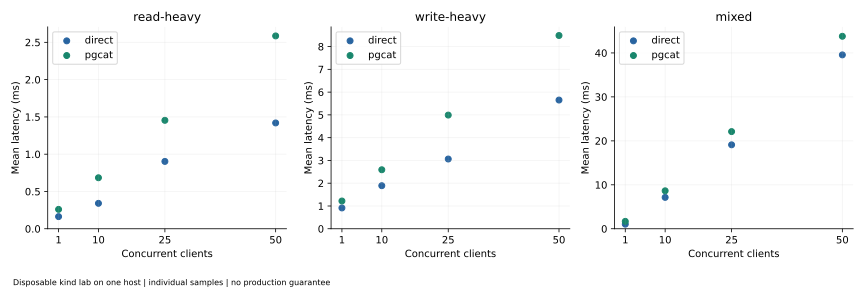
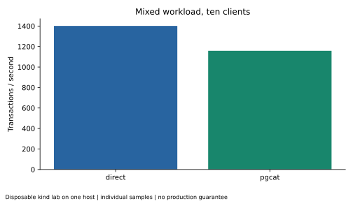
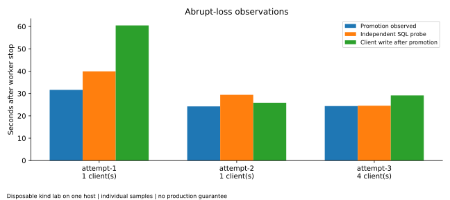
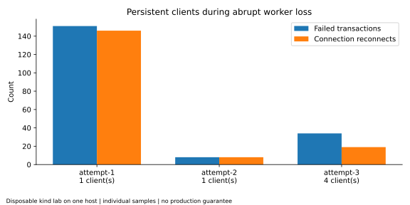
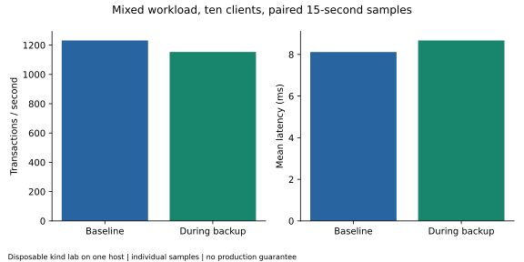
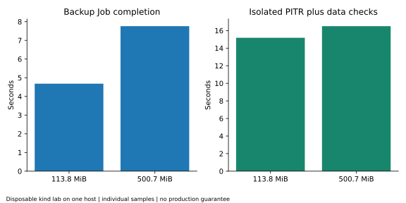
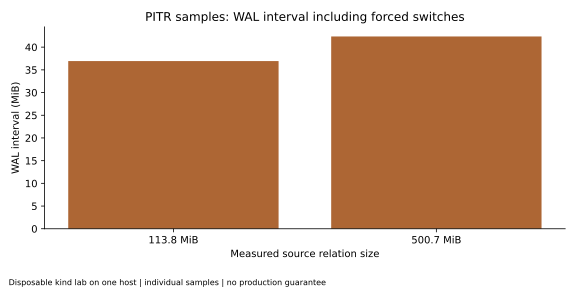

# Performance results

These are disposable single-host measurements, not capacity commitments, an SLA, or production recovery objectives. Historical failed/aborted attempts are excluded from successful sample counts and remain in the evidence tree.

## Environment and methodology

The final matrix used PostgreSQL 16.6, Patroni 4.0.4, PgCat 1.2.0, Kubernetes 1.30.0 and Calico 3.28.2; three database members and two proxies shared one Docker host with local-path storage. The recorded working tree was dirty, so the Git revision alone does not reproduce it. [raw evidence](../../results/runtime/multinode/dbaas-phase5-bc4cacdf48/environment.json)

PostgreSQL pgbench scale 1; ten seconds per point; one sample per route/profile/concurrency; at most four client threads. Read-heavy weights select-only:simple-update 9:1, write-heavy uses simple-update, and mixed uses tpcb-like. Logical balances are reset; caches are not cold-started. There is no dedicated warm-up, randomized route order or replica catch-up barrier. Direct traffic uses the primary, while PgCat enables query parsing and read/write splitting across role Services; the routes are not a pure measurement of proxy overhead. Both proxies use transaction pooling and a pool budget of 60; max_connections is 200 to accommodate idle pools, direct clients and operational headroom. This was a documented budget, not a tuning search. [raw evidence](../../results/benchmarks/dbaas-phase5-bc4cacdf48/matrix/attempt-1/pgbench.json)

## Direct PostgreSQL and PgCat matrix

| Profile | Clients | Direct TPS | PgCat TPS | Direct mean ms | PgCat mean ms | Failed transactions, direct / proxy |
|---|---:|---:|---:|---:|---:|---:|
| read-heavy | 1 | 6136.006 | 3848.447 | 0.163 | 0.260 | 0 / 0 |
| read-heavy | 10 | 29301.259 | 14627.380 | 0.341 | 0.684 | 0 / 0 |
| read-heavy | 25 | 27682.535 | 17197.353 | 0.903 | 1.454 | 0 / 0 |
| read-heavy | 50 | 35246.178 | 19333.874 | 1.419 | 2.586 | 0 / 0 |
| write-heavy | 1 | 1093.537 | 820.229 | 0.914 | 1.219 | 0 / 0 |
| write-heavy | 10 | 5289.425 | 3859.471 | 1.891 | 2.591 | 0 / 0 |
| write-heavy | 25 | 8164.526 | 5008.597 | 3.062 | 4.991 | 0 / 0 |
| write-heavy | 50 | 8847.526 | 5892.591 | 5.651 | 8.485 | 0 / 0 |
| mixed | 1 | 954.399 | 593.854 | 1.048 | 1.684 | 0 / 0 |
| mixed | 10 | 1401.014 | 1158.075 | 7.138 | 8.635 | 0 / 0 |
| mixed | 25 | 1309.131 | 1130.951 | 19.097 | 22.105 | 0 / 0 |
| mixed | 50 | 1264.074 | 1141.853 | 39.555 | 43.788 | 0 / 0 |

All table values: [raw evidence](../../results/benchmarks/dbaas-phase5-bc4cacdf48/matrix/attempt-1/pgbench.json). Reconnects and latency percentiles were not reported and remain null. There is no statistical significance claim. The proxy is evaluated as a connection/routing layer; these samples do not establish that it is faster.

## Failover under load

Four clients acknowledged 20,624 writes, with 34 failed transactions, 19 reconnects, no replay retries and no missing acknowledged IDs. Promotion was observed at 24.378 seconds, the independent SQL probe at 24.554, and the first client acknowledgement after observed promotion at 29.150. [raw evidence](../../results/runtime/multinode/dbaas-phase5-bc4cacdf48/failover-windows.json)

Before/during/after TPS: 291.766, 0.489, 315.971. The during window ends at the independent probe; the after window still includes client errors. Sequential startup affects the baseline. [raw evidence](../../results/runtime/multinode/dbaas-phase5-bc4cacdf48/failover-windows.json)

## Backup impact

Baseline 1231.640 TPS versus 1152.865 TPS during backup: **-6.40%** relative change, calculated from raw values by this reporting script. Mean latency changed from 8.119 to 8.674 ms. Backup Job completion took 5.763 seconds. [raw evidence](../../results/benchmarks/dbaas-phase5-bc4cacdf48/matrix/attempt-1/backup-impact.json)

Retained container CPU and filesystem read/write counters are available, but short scrape windows do not isolate backup cost or PVC durability. [raw evidence](../../results/benchmarks/dbaas-phase5-bc4cacdf48/matrix/attempt-1/backup-resource-metrics.json)

## Restore and PITR measurements

| Relation size | Backup Job seconds | Restore and writable/data checks, seconds | WAL interval bytes |
|---|---:|---:|---:|
| [113.8 MiB](../../results/runtime/multinode/dbaas-phase5-bc4cacdf48/restore-size/attempt-1/result.json) | 4.681 | 15.181 | 38,726,304 |
| [500.7 MiB](../../results/runtime/multinode/dbaas-phase5-bc4cacdf48/restore-size/attempt-2/result.json) | 7.757 | 16.499 | 44,403,544 |

Payloads repeat md5 strings and compress well. Restore time includes scheduling, bootstrap, PITR and assertions; replay alone is not timed. WAL intervals begin before backup and include forced switches, excluding payload-generation WAL. Backup catalog sizes describe the whole cluster. These observations do not define a scaling curve.

## Historical context

The [earlier matrix](../../results/benchmarks/dbaas-phase5-8a3ad9f385/pgbench.json) remains separate. Its aborted session-pooling attempt is retained under that run's attempts directory. The final transaction-pooling results do not prove compatibility with every session-dependent SQL feature. No new live benchmark was run during packaging.
